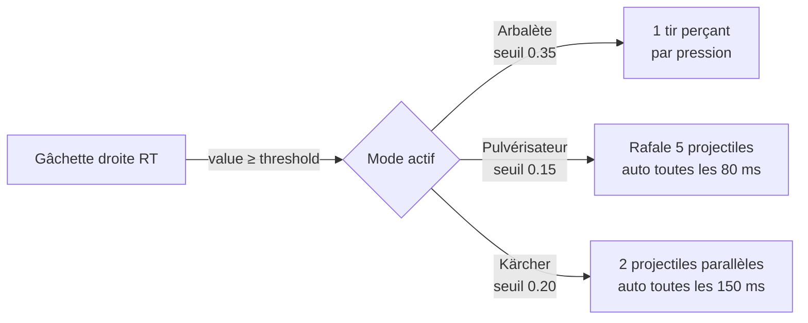

# Composants

## LCSMenuView

**Fichier :** `LCSMenuView.swift`  
**Type :** `public struct LCSMenuView: View`

Point d'entrée public du package. C'est le seul type que l'application hôte instancie.

### Responsabilités

- Routeur principal : maintient `currentScreen: AppScreen` et détermine quelle vue afficher
- Gère le cycle de vie d'une partie (démarrage, pause, game over, redémarrage)
- Coordonne les overlays : pause, saisie du nom pour le high score, paywall
- Connecte `LCSGamepadManager` au menu via `LCSGamepadMenuCoordinator`

### Interface publique

```swift
public struct LCSMenuView: View {
    public init(onExitToNikolai: (() -> Void)? = nil)
}
```

Le paramètre `onExitToNikolai` est optionnel ; s'il est fourni, un bouton "← Nikolai" apparaît en haut de l'écran titre pour permettre à l'utilisateur de revenir à l'application hôte.

---

## LCSGameView

**Fichier :** `LCSGameView.swift`  
**Type :** `public struct LCSGameView: View`

Pont entre SwiftUI et SpriteKit. Crée et héberge la `GameScene`.

### Fonctionnement

```swift
public struct LCSGameView: View {
    public init(
        gamepadManager: LCSGamepadManager,
        level: LCSLevel,
        sessionID: UUID,           // changé pour forcer la recréation de la scène
        onExitToTitle: @escaping () -> Void,
        onGameOver: @escaping (Int) -> Void = { _ in },
        onLevelStats: @escaping (LevelStats) -> Void = { _ in },
        isPaused: Binding<Bool> = .constant(false)
    )
}
```

Le `sessionID` est régénéré à chaque démarrage/redémarrage de partie, ce qui déclenche la recréation de la `GameScene` via le `onChange` sur ce binding.

---

## GameScene

**Fichier :** `GameScene.swift`  
**Type :** `final class GameScene: SKScene`

Contient toute la logique de jeu SpriteKit. Annotée `@MainActor`.

### Système de physique

Les catégories de collision sont définies avec des masques de bits :

| Catégorie | Masque |
|---|---|
| `player` | `0b00001` |
| `playerBullet` | `0b00010` |
| `enemy` | `0b00100` |
| `enemyBullet` | `0b01000` |
| `bonus` | `0b10000` |

### Mécanique de vague

À chaque vague, une grille d'ennemis est générée :

- **Colonnes :** `min(8, 5 + wave)`
- **Lignes :** `min(4, 2 + wave)`
- **Vitesse ennemis :** `(30 + (wave − 1) × 10) × scale` pt/s
- **Intervalle de tir ennemi :** `max(0.8, 2.0 − (wave − 1) × 0.2)` secondes

### Modes de tir joueur

| Mode | Déclencheur | Comportement |
|---|---|---|
| Tir simple | Touch / bouton A manette | 1 projectile droit, cooldown 250 ms |
| Triple tir | Touch prolongé / RB ou X manette | 3 projectiles en éventail (±160 × scale px/s), cooldown 250 ms |
| Arbalète (manette RT) | Gâchette droite, mode Arbalète | 1 projectile perçant, cooldown 550 ms |
| Pulvérisateur (manette RT) | Gâchette droite, mode Pulvérisateur | 5 projectiles en éventail, cooldown 100 ms |
| Kärcher (manette RT) | Gâchette droite, mode Kärcher | 2 projectiles parallèles, cooldown 180 ms |

### Gestion du fond progressif

Le fond évolue tous les 5 niveaux complétés (jusqu'au niveau 20), via un crossfade de 600 ms.

---

## LCSLevel & LevelTheme

**Fichier :** `LCSLevel.swift`

`LCSLevel` est l'enum central qui identifie chacun des 9 niveaux. Chaque cas expose :

- `backgroundImageName` : nom de l'image de fond dans `Assets.xcassets`
- `levelTitle`, `descriptionText`, `bonusText`, `previewEmojis`
- `isFree` : seul `.cave` est gratuit
- `theme` : un `LevelTheme` qui encapsule les emojis héros, ennemis et bonus

`LevelTheme` est une structure qui associe à chaque `EnemyType` un emoji et un nom interne, et définit le bonus du niveau.

---

## SoundManager

**Fichier :** `SoundManager.swift`  
**Type :** `@MainActor final class SoundManager`

Singleton qui gère l'audio et les haptiques. Tous les effets sonores sont générés **procéduralement** via `AVAudioEngine` et `AVAudioPCMBuffer` ; il n'y a aucun fichier audio pour les effets.

La musique de fond (`.m4a` / `.mp3`) est lue par un `AVAudioPlayer` distinct, en boucle infinie au volume 0.7.

### Effets

| Méthode | Déclencheur | Haptique |
|---|---|---|
| `playShoot()` | Tir joueur | `.light` 40% |
| `playEnemyHit()` | Ennemi détruit | `.light` 60% |
| `playPlayerHit()` | Joueur touché | `.heavy` 100% |
| `playBonusHit()` | Bonus intercepté | `.success` |
| `playWaveComplete()` | Fin de vague | `.success` |
| `playGameOver()` | Fin de partie | `.error` |
| `playExplosion()` | Mort joueur | `.medium` |

Les manettes DualSense ont des haptiques dédiés via `CoreHaptics` / `CHHapticEngine`.

---

## LCSGamepadManager & TriggerMode

**Fichier :** `LCSGamepadManager.swift`

Gère la connexion aux manettes MFi (et DualSense) via `GameController`. Il se branche sur les notifications `GCControllerDidConnect` / `GCControllerDidDisconnect` et configure les handlers d'entrée.

`TriggerMode` est un enum `public` qui définit le comportement de la gâchette droite :



Pour le DualSense, la résistance adaptative de la gâchette est configurée via `GCDualSenseGamepad` selon le mode sélectionné.

---

## HighScoreStore

**Fichier :** `HighScoreStore.swift`

Stocke jusqu'à **3 meilleurs scores** par niveau dans `UserDefaults` (clé `LCSHighScores`), encodés en JSON. Expose :

- `topEntries(for:)` — top 3 triés par score décroissant
- `rankIfQualified(score:for:)` — retourne le rang (1–3) si le score entre dans le top 3, sinon `nil`
- `save(score:playerName:for:)` — persiste l'entrée après sanitisation du nom (majuscules, 12 caractères max)

---

## StatsStore

**Fichier :** `StatsStore.swift`

Agrège les statistiques cumulatives de jeu par niveau dans `UserDefaults` (préfixe `lcs.stats.<level>`).

Métriques trackées par niveau :

- Kills cumulés, parties jouées, bonus activés
- Temps de jeu total
- Meilleur score, meilleure vague
- Tirs tirés / tirs touchés (→ précision)

---

## GameCenterManager

**Fichier :** `GameCenterManager.swift`

Gère l'authentification Game Center, la soumission des scores aux classements et le déclenchement des succès.

### Classements

Un classement par niveau (`scores.<level>`) + un classement total (`scores.total`) + un classement défi (`lsi.defi.score`).

### Succès

| ID | Condition |
|---|---|
| `ach.first_eviction` | Terminer n'importe quelle partie |
| `ach.grand_score` | Score ≥ 10 000 en une partie |
| `ach.clean_sweep` | Compléter une vague sans se faire toucher |
| `ach.speedrun` | Compléter la 1ère vague en moins de 90 secondes |
| `ach.exterminator` | Éliminer 100 ennemis dans La Cave (cumulatif) |
| `ach.bonus_collector` | Activer 10 bonus (cumulatif toutes niveaux) |
| `ach.all_levels` | Jouer sur les 9 niveaux |

---

## PurchaseStore

**Fichier :** `PurchaseStore.swift`

Gère l'achat unique "débloquer tous les niveaux" via StoreKit 2. Expose `isUnlocked: Bool` observable par SwiftUI. Le niveau La Cave est toujours gratuit (`LCSLevel.isFree`).
