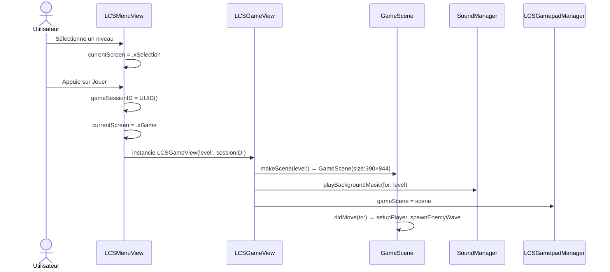
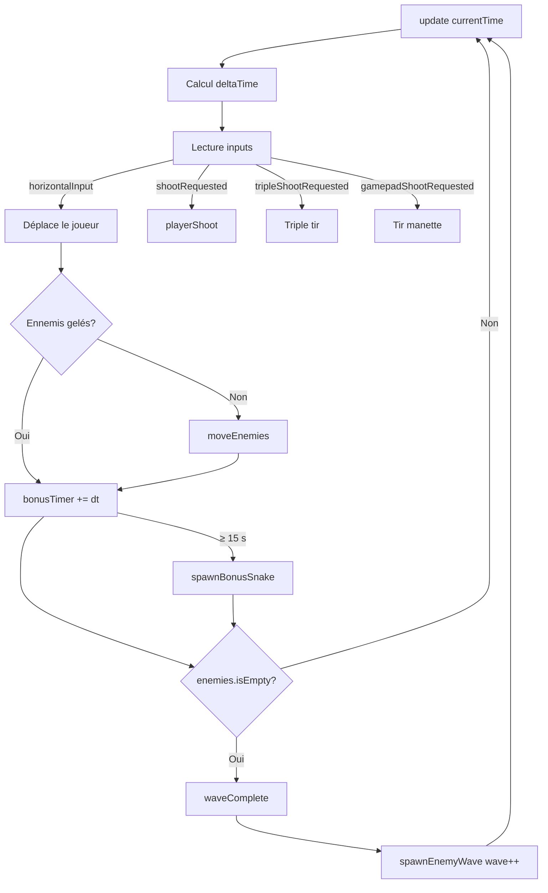
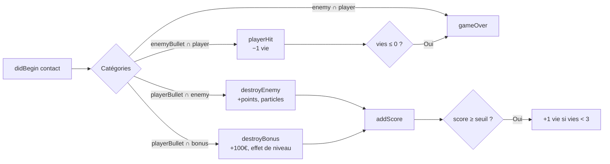
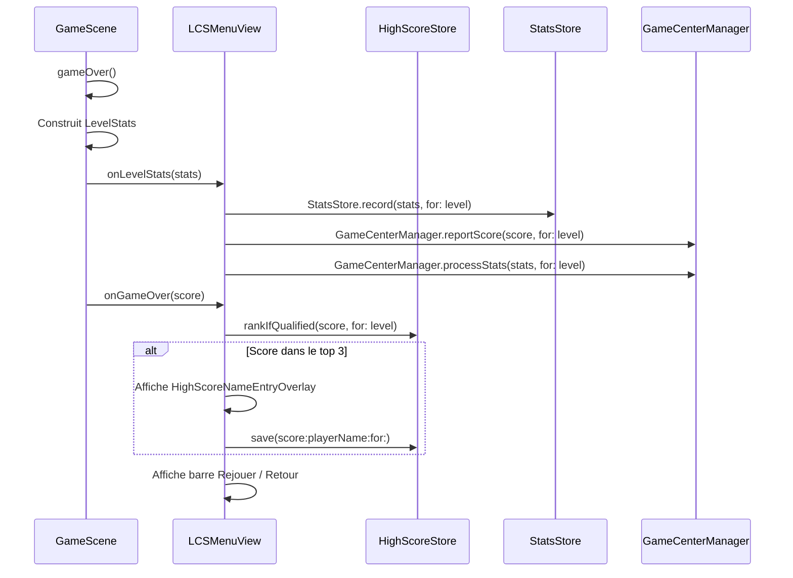
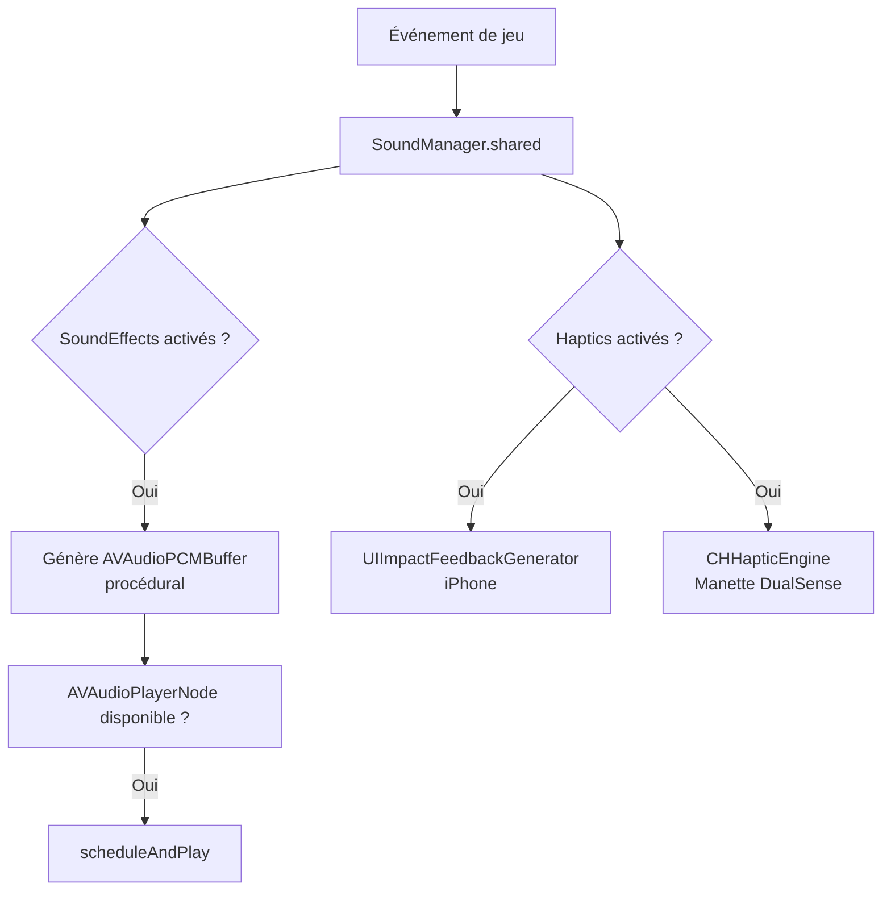
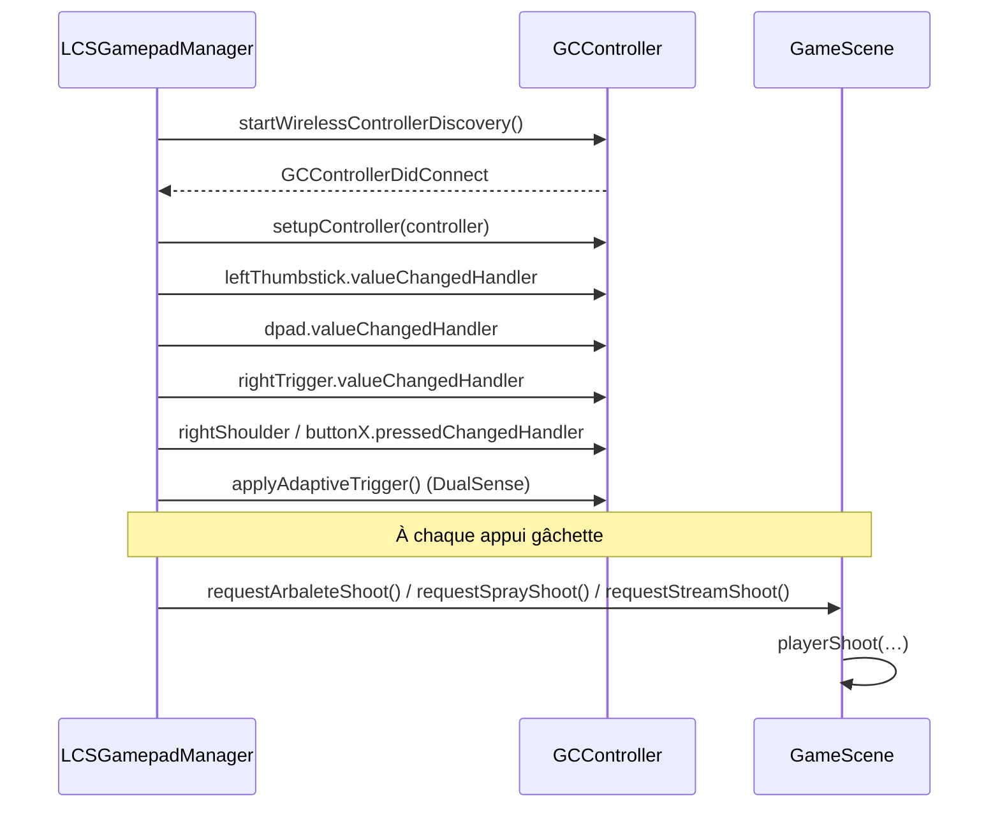

# Flux de données

## Démarrage d'une partie

```mermaid
sequenceDiagram
    actor U as Utilisateur
    participant MV as LCSMenuView
    participant GV as LCSGameView
    participant GS as GameScene
    participant SM as SoundManager
    participant GM as LCSGamepadManager

    U->>MV: Sélectionne un niveau
    MV->>MV: currentScreen = .xSelection
    U->>MV: Appuie sur Jouer
    MV->>MV: gameSessionID = UUID()
    MV->>MV: currentScreen = .xGame
    MV->>GV: instancie LCSGameView(level:, sessionID:)
    GV->>GS: makeScene(level:) → GameScene(size:390×844)
    GV->>SM: playBackgroundMusic(for: level)
    GV->>GM: gameScene = scene
    GS->>GS: didMove(to:) → setupPlayer, spawnEnemyWave
```

## Boucle de jeu

```mermaid
flowchart TD
    U[update currentTime] --> DT[Calcul deltaTime]
    DT --> IN[Lecture inputs]
    IN --> |horizontalInput| MP[Déplace le joueur]
    IN --> |shootRequested| SH[playerShoot]
    IN --> |tripleShootRequested| TS[Triple tir]
    IN --> |gamepadShootRequested| GS[Tir manette]
    MP --> EF{Ennemis gelés?}
    EF --> |Non| ME[moveEnemies]
    EF --> |Oui| BT[bonusTimer += dt]
    ME --> BT
    BT --> |≥ 15 s| SB[spawnBonusSnake]
    BT --> EC{enemies.isEmpty?}
    SB --> EC
    EC --> |Oui| WC[waveComplete]
    EC --> |Non| U
    WC --> NW[spawnEnemyWave wave++]
    NW --> U
```

## Collision physique

```mermaid
flowchart LR
    C[didBegin contact] --> CAT{Catégories}
    CAT --> |playerBullet ∩ enemy| DE[destroyEnemy<br/>+points, particles]
    CAT --> |playerBullet ∩ bonus| DB[destroyBonus<br/>+100€, effet de niveau]
    CAT --> |enemyBullet ∩ player| PH[playerHit<br/>−1 vie]
    CAT --> |enemy ∩ player| GO[gameOver]
    DE --> SC[addScore]
    DB --> SC
    SC --> LT{score ≥ seuil ?}
    LT --> |Oui| EV[+1 vie si vies < 3]
    PH --> ZL{vies ≤ 0 ?}
    ZL --> |Oui| GO
```

## Fin de partie et persistance

```mermaid
sequenceDiagram
    participant GS as GameScene
    participant MV as LCSMenuView
    participant HS as HighScoreStore
    participant SS as StatsStore
    participant GC as GameCenterManager

    GS->>GS: gameOver()
    GS->>GS: Construit LevelStats
    GS->>MV: onLevelStats(stats)
    MV->>SS: StatsStore.record(stats, for: level)
    MV->>GC: GameCenterManager.reportScore(score, for: level)
    MV->>GC: GameCenterManager.processStats(stats, for: level)
    GS->>MV: onGameOver(score)
    MV->>HS: rankIfQualified(score, for: level)
    alt Score dans le top 3
        MV->>MV: Affiche HighScoreNameEntryOverlay
        MV->>HS: save(score:playerName:for:)
    end
    MV->>MV: Affiche barre Rejouer / Retour
```

## Gestion audio et haptiques

```mermaid
flowchart TD
    EV[Événement de jeu] --> SM[SoundManager.shared]
    SM --> SE{SoundEffects activés ?}
    SE --> |Oui| BF[Génère AVAudioPCMBuffer<br/>procédural]
    BF --> PN[AVAudioPlayerNode disponible ?]
    PN --> |Oui| PL[scheduleAndPlay]
    SM --> HX{Haptics activés ?}
    HX --> |Oui| IP[UIImpactFeedbackGenerator<br/>iPhone]
    HX --> |Oui| CH[CHHapticEngine<br/>Manette DualSense]
```

## Initialisation de la manette

```mermaid
sequenceDiagram
    participant GM as LCSGamepadManager
    participant GC as GCController
    participant GS as GameScene

    GM->>GC: startWirelessControllerDiscovery()
    GC-->>GM: GCControllerDidConnect
    GM->>GC: setupController(controller)
    GM->>GC: leftThumbstick.valueChangedHandler
    GM->>GC: dpad.valueChangedHandler
    GM->>GC: rightTrigger.valueChangedHandler
    GM->>GC: rightShoulder / buttonX.pressedChangedHandler
    GM->>GC: applyAdaptiveTrigger() (DualSense)
    Note over GM,GS: À chaque appui gâchette
    GM->>GS: requestArbaleteShoot() / requestSprayShoot() / requestStreamShoot()
    GS->>GS: playerShoot(…)
```
