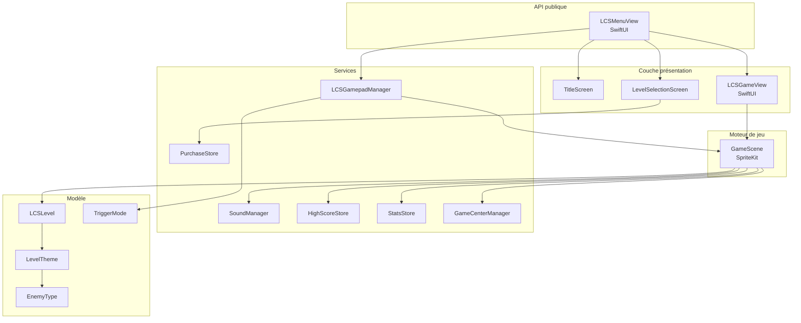
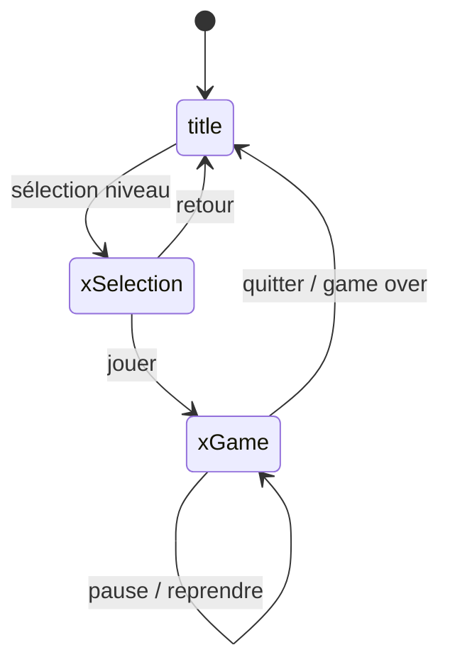

# Vue d'ensemble de l'architecture

LCSGameKit adopte une architecture en couches qui sépare la présentation SwiftUI, le moteur de jeu SpriteKit et les services transverses.

## Diagramme des composants



## Principes architecturaux

### SwiftUI + SpriteKit

Le package hybride deux frameworks Apple :

- **SwiftUI** gère tous les menus, overlays et transitions entre écrans via `LCSMenuView`, une vue racine qui joue le rôle de routeur applicatif.
- **SpriteKit** prend en charge toute la logique de jeu dans `GameScene`. Il est encapsulé par `LCSGameView` via `SpriteView`, ce qui permet de l'utiliser comme n'importe quelle vue SwiftUI.

### Isolation `@MainActor`

L'ensemble des classes sensibles à l'interface (`GameScene`, `SoundManager`, `LCSGamepadManager`, `GameCenterManager`, `StatsStore`) est annoté `@MainActor`. Cela garantit que toutes les mutations d'état se produisent sur le thread principal, en conformité avec Swift 6.

### Modèle de navigation (machine à états)

`LCSMenuView` maintient un état `AppScreen` (enum) qui détermine quel écran est affiché. Les transitions se font via `withAnimation` :



### Données persistantes

Toutes les données de l'utilisateur sont stockées dans `UserDefaults.standard`. Aucune dépendance externe n'est requise.

| Clé UserDefaults | Valeur | Gestionnaire |
|---|---|---|
| `LCSSoundEffectsEnabled` | Bool | `SoundManager` |
| `LCSMenuMusicEnabled` | Bool | `SoundManager` |
| `LCSHapticsEnabled` | Bool | `SoundManager` |
| `LCSTriggerSensitivity` | String (rawValue) | `LCSGamepadManager` |
| `LCSAdaptiveTriggerEnabled` | Bool | `LCSGamepadManager` |
| `LCSHighScores` | Data (JSON) | `HighScoreStore` |
| `lcs.stats.<level>.*` | Int / Double | `StatsStore` |

## Structure des fichiers sources

```
Sources/LCSGameKit/
├── GameCenterManager.swift   # Game Center + LevelStats
├── GameScene.swift           # Moteur SpriteKit
├── HighScoreStore.swift      # Meilleurs scores locaux
├── LCSGamepadManager.swift   # Manette + TriggerMode
├── LCSGamepadMenuCoordinator.swift  # Navigation manette dans les menus
├── LCSGameView.swift         # Pont SwiftUI → SpriteKit
├── LCSLevel.swift            # Enum niveaux + thèmes
├── LCSMenuView.swift         # Navigation, menus, overlays
├── LCSNowPlayingBars.swift   # Composants boutons réutilisables
├── PurchaseStore.swift       # StoreKit 2
├── SoundManager.swift        # Audio procédural + haptiques
└── StatsStore.swift          # Statistiques persistantes
```
