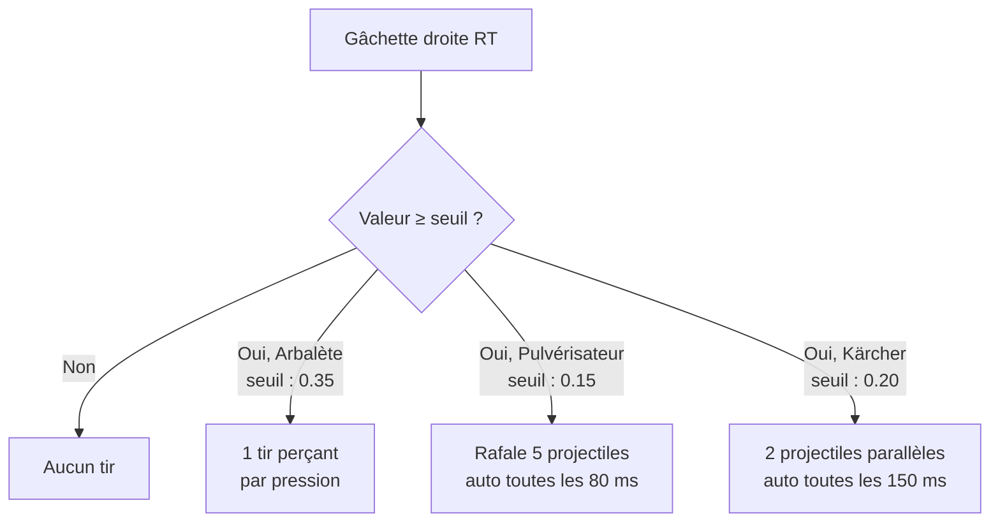

# Commandes

Le jeu supporte deux modes de contrôle : **écran tactile** et **manette** (MFi / DualSense).

## Écran tactile (iPhone / iPad)

| Geste | Action |
|---|---|
| Appui simple | Tirer |
| Glisser horizontalement | Déplacer le personnage |
| Relâcher le doigt | Arrêter le déplacement |

Le déplacement est proportionnel à la vitesse du glissement (`dx / 5.0`). Un appui statique tire sans se déplacer.

---

## Manette (MFi / DualSense)

La manette est détectée automatiquement à la connexion (Bluetooth ou filaire). Le premier contrôleur détecté est utilisé.

### En jeu

| Bouton / Axe | Action |
|---|---|
| Stick gauche (axe X) | Déplacer le personnage |
| Croix directionnelle (←→) | Déplacer le personnage |
| Gâchette droite **RT** | Tirer (selon le mode sélectionné) |
| Bumper droit **RB** | Triple tir |
| Bouton **X** | Triple tir |
| Bouton **Y** | Pause / Reprendre |

### Dans les menus

| Bouton | Action |
|---|---|
| **A** | Valider / Jouer |
| **Y** | Retour |
| **↑ / ↓** | Naviguer entre les niveaux (écran titre) |
| **Menu** | Afficher / masquer les commandes |

### Triple tir

En activant RB ou X, le joueur tire **3 projectiles simultanément** en éventail :

```
    ↗ ↑ ↖
       🧹
```

Les projectiles latéraux ont une vélocité horizontale de ±160 × scale px/s en plus de la vélocité verticale normale.

---

## Modes de gâchette (manette uniquement)

Le mode de tir de la gâchette droite se configure dans le panneau **GX** de l'écran titre.



### Arbalète *(mode par défaut)*

- **Seuil d'activation :** 0,35 (appui net requis)
- **Comportement :** 1 tir perçant (traverse les ennemis) par pression. Pas de tir automatique.
- **DualSense :** résistance de type "arme" (feedback mécanique au point de tir)

### Pulvérisateur

- **Seuil d'activation :** 0,15 (appui léger suffit)
- **Comportement :** 5 projectiles en éventail large, tirés automatiquement toutes les 80 ms tant que la gâchette est maintenue
- **DualSense :** vibration rapide de la gâchette

### Kärcher

- **Seuil d'activation :** 0,20
- **Comportement :** 2 projectiles parallèles légèrement décalés, tirés automatiquement toutes les 150 ms tant que la gâchette est maintenue
- **DualSense :** résistance continue (feedback de pression)

---

## Résistance adaptative DualSense

Disponible uniquement avec une manette **PS5 DualSense** connectée. Elle simule physiquement la résistance de la gâchette en fonction du mode de tir sélectionné.

| Mode | Ressenti |
|---|---|
| Arbalète | Point de déclenchement net, tension maximale |
| Pulvérisateur | Vibration haute fréquence (pschitt) |
| Kärcher | Résistance progressive et continue |

Cette option se désactive indépendamment dans le panneau GX si la résistance est gênante.

---

## Pause en jeu

La pause est accessible :

- Bouton ⏸ en haut à gauche de l'écran (tactile)
- Bouton **Y** sur la manette

L'overlay de pause propose deux actions :

| Bouton | Action |
|---|---|
| REPRENDRE | Reprend la partie, la musique repart |
| QUITTER LA PARTIE | Retour à l'écran titre |

La musique est mise en pause automatiquement ; elle reprend à la reprise.
