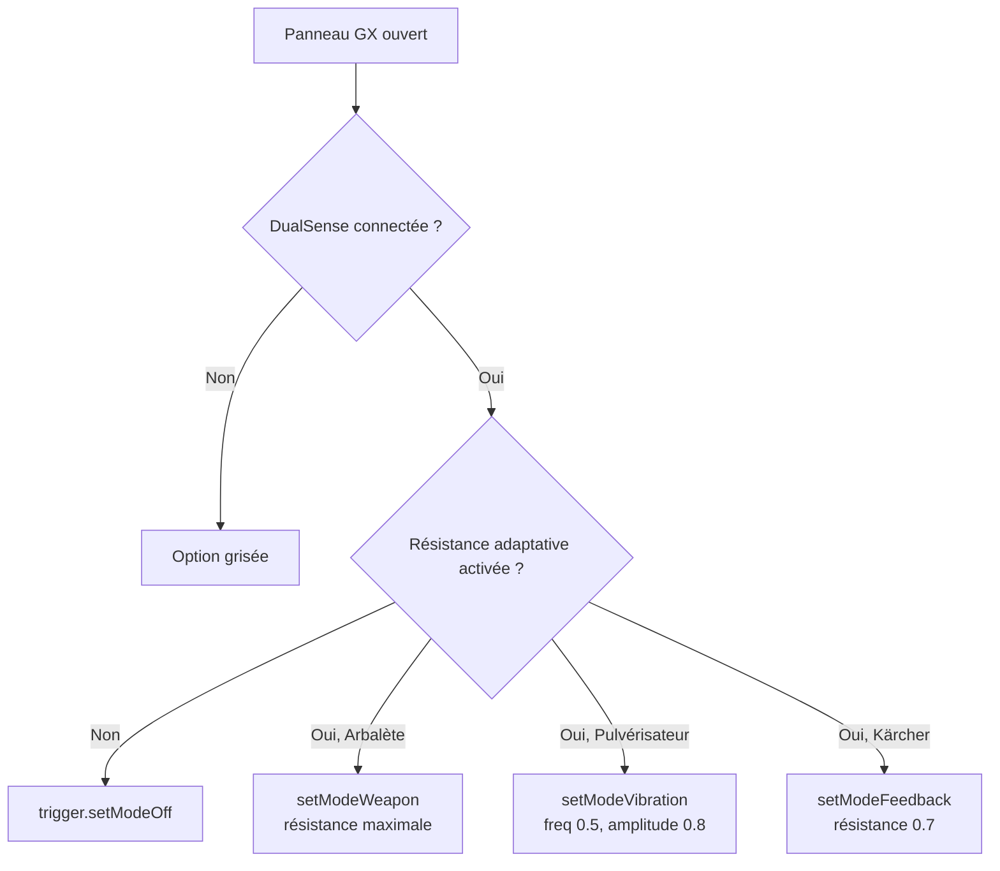

# Paramètres

Les options de jeu sont accessibles depuis la barre de réglages en bas de l'**écran titre**. Tous les paramètres sont persistés dans `UserDefaults` et s'appliquent immédiatement.

## Barre de réglages

```
[ FX ]  [ MX ]  [ HX ]  [ GX ]  [ ST ]
```

| Bouton | Réglage | Clé UserDefaults |
|---|---|---|
| **FX** | Effets sonores | `LCSSoundEffectsEnabled` |
| **MX** | Musique des menus | `LCSMenuMusicEnabled` |
| **HX** | Haptiques | `LCSHapticsEnabled` |
| **GX** | Options manette | *(ouvre un panneau)* |
| **ST** | Statistiques | *(ouvre un panneau)* |

---

## FX — Effets sonores

Active ou désactive tous les effets audio générés procéduralement (tirs, impacts, bonus, game over…).

- **Activé par défaut**
- Désactiver FX coupe immédiatement tous les effets en cours de lecture
- N'affecte pas la musique de fond

---

## MX — Musique

Active ou désactive la musique de fond (écran titre et en jeu).

- **Activé par défaut**
- La musique de l'écran titre (`intro.mp3`) est démarrée/stoppée en temps réel lors du changement
- Chaque niveau a sa propre piste musicale qui se lance à l'entrée en jeu

| Niveau | Fichier |
|---|---|
| La Cave | `cave.m4a` |
| La Banque | `bank.m4a` |
| Le Garage | `garage.m4a` |
| Le Notaire | `notaire.m4a` |
| Le Jardin | `jardin.mp3` |
| Le Bassin | `bassin.mp3` |
| L'Infirmerie | `infirmerie` *(à venir)* |
| La Salle Visio | `visio` *(à venir)* |
| Le Gymnase | `gymnase.mp3` |

---

## HX — Haptiques

Active ou désactive les retours haptiques sur l'iPhone et sur la manette DualSense.

- **Activé par défaut**
- Une vibration de confirmation se déclenche à l'activation si l'option vient d'être réactivée
- Sur DualSense : les effets sont fournis via `CoreHaptics` / `CHHapticEngine`

| Événement | iPhone | DualSense |
|---|---|---|
| Tir | `.light` 40% | intensité 0.3, sharpness 0.9 |
| Ennemi touché | `.light` 60% | intensité 0.5, sharpness 0.6 |
| Joueur touché | `.heavy` 100% | intensité 1.0, sharpness 0.2, durée 0.3 s |
| Bonus intercepté | `.success` | intensité 0.7, sharpness 0.9 |
| Fin de vague | `.success` | intensité 0.6, sharpness 0.8 |
| Game Over | `.error` | intensité 0.8, sharpness 0.1, durée 0.8 s |

---

## GX — Options manette

Ouvre un panneau qui permet de configurer le comportement de la gâchette droite et la résistance adaptative.

> Ce panneau est grisé si aucune manette n'est connectée.

### Mode de gâchette

| Mode | Icône | Description |
|---|---|---|
| Arbalète | `arrow.up.to.line` | Un tir précis par pression. Seuil 0.35. |
| Pulvérisateur | `shower.handheld` | Rafale large automatique. Seuil 0.15, auto toutes les 80 ms. |
| Kärcher | `water.waves` | Jet continu en parallèle. Seuil 0.20, auto toutes les 150 ms. |

**Clé UserDefaults :** `LCSTriggerSensitivity`  
**Valeur par défaut :** `arbalete`

### Résistance adaptative

Option disponible uniquement avec une manette **PS5 DualSense**.

- **Activée par défaut**
- Simule physiquement la résistance de la gâchette selon le mode sélectionné
- **Clé UserDefaults :** `LCSAdaptiveTriggerEnabled`



---

## ST — Statistiques

Ouvre un panneau récapitulatif de l'ensemble de vos parties.

### Compteurs globaux

| Métrique | Description |
|---|---|
| Éliminations | Total d'ennemis détruits toutes parties confondues |
| Parties | Nombre total de parties jouées |
| Temps | Temps de jeu cumulé |
| Bonus | Total de bonus interceptés |
| Tirs tirés | Total de projectiles tirés |
| Tirs touchés | Projectiles ayant touché un ennemi |
| Précision | Tirs touchés / Tirs tirés |

### Statistiques par niveau

Pour chaque niveau, le panneau affiche :

- Éliminations et parties jouées
- Meilleur score (en €) et meilleure vague atteinte
- Tirs tirés, tirs touchés et précision
- Graphique en barres (éliminations par niveau via Swift Charts)

Les statistiques sont stockées localement dans `UserDefaults` et ne se réinitialisent pas entre les sessions.

!!! note "Synchronisation iCloud"
    Le code source prévoit la possibilité de remplacer `UserDefaults.standard` par `NSUbiquitousKeyValueStore.default` dans `StatsStore` pour synchroniser les statistiques entre appareils via iCloud Key-Value Storage. Cette fonctionnalité nécessite d'activer **iCloud → Key-value storage** dans les *Signing & Capabilities* de la cible principale.

---

## AirPlay

Un bouton AirPlay est disponible en haut à droite de l'écran titre pour diffuser l'audio sur un équipement externe (Apple TV, enceinte AirPlay…). La vidéo reste sur l'iPhone.

---

## Meilleurs scores locaux

Un classement **Top 3** par niveau est affiché sur l'écran de sélection de chaque niveau.

- À la fin d'une partie, si le score entre dans le Top 3, une fenêtre de saisie de nom apparaît
- Le nom est limité à **12 caractères**, automatiquement converti en majuscules
- Un nom vide est enregistré comme **ANONYME**
- Les scores sont persistés en JSON dans `UserDefaults` (clé `LCSHighScores`)

Les mêmes scores sont également soumis aux **classements Game Center** (un par niveau + un classement total + un classement défi).
